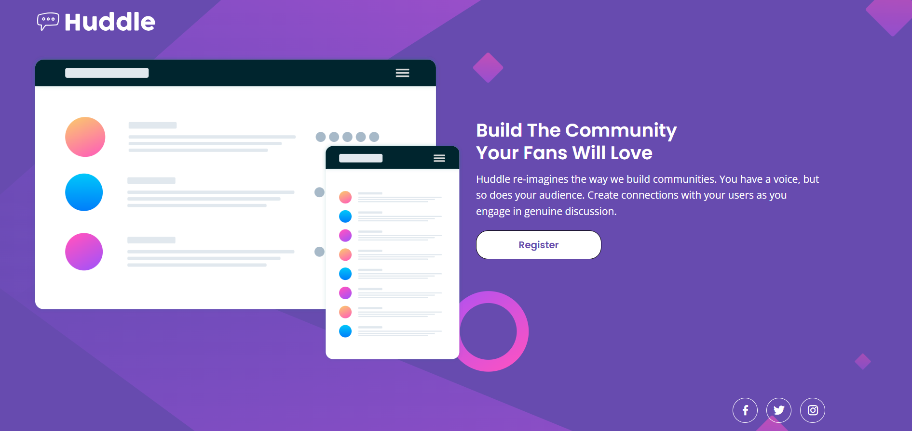

# Frontend Mentor - Huddle Landing Page

## Table of contents

- [Process](#process)
- [Screenshot](#screenshot)
- [What I learned](#what-i-learned)
- [Future Improvements](#future-improvments)
- [Author](#author)

## Process

 I used CSS Grid for the core of the layout. 
 I attempted to keep both the image and the
 adjacent text both well-proportioned as the 
 screen reduces in size. Then, at smaller 
 screen sizes there is grid-template-areas 
 structural change in layout. 

## Screenshot

;

## What I learned

1. Utilising the &: with nth-child to identify 
a particular element within SASS: 

```
      span {
        display: block;

        &:nth-child(2) {
          margin-top: -0.625rem;
        }
      }
```

2. Utilising keyframes to move
an element when the website has just loaded. 

```
@keyframes logo__move {
    from {
        transform: translateX(-20%);
    }

    to {
        transform: translateX(0%);
    }
}

header a {
    animation: logo__move 1s;
}
```

## Future Improvements

At the initial design stage, I probably could 
have filled the text within a ul. Also, I could 
have spent a bit more time thinking about the 
ideal mobile-layout at the opening stages. 

## Author 

Dilhan Boca

- Frontend Mentor - [@dboca93](https://www.frontendmentor.io/profile/dboca93)
- Twitter - [@dboca93](https://www.twitter.com/dboca93)

dboca93@gmail.com